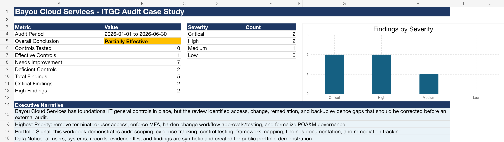

# Completed ITGC Audit Case Study

This folder turns the toolkit into a complete, recruiter-ready portfolio case study. It presents a fictional IT general controls audit for **Bayou Cloud Services**, using synthetic evidence and generated workpapers.

## Start Here

| Artifact | Purpose |
|---|---|
| [Scope and Methodology](./scope-and-methodology.md) | Defines the audit objective, scope, systems, period, criteria, and sampling approach. |
| [Completed Workpaper Package](./bayou-cloud-itgc-audit-case-study.xlsx) | Excel workbook with the executive summary, risk/control matrix, evidence register, testing workpapers, findings, POA&M tracker, and NIST mapping. |
| [Final Audit Report](./final-audit-report.md) | Completed management-facing report with overall conclusion and detailed findings. |
| [Final Audit Report PDF](./final-audit-report.pdf) | Polished PDF version of the completed audit report. |
| [Resume Bullets](./resume-bullets.md) | Interview and resume language based on the project. |

## Case Study Scenario

Bayou Cloud Services is a fictional mid-market SaaS company preparing for a SOC 2 readiness review and an internal ITGC assessment. The case study covers the period **January 1, 2026 through June 30, 2026**.

The audit focuses on:

- User access reviews
- Terminated-user deprovisioning
- Privileged access and MFA
- Change approval and segregation of duties
- Audit logging and monitoring
- Vulnerability remediation governance
- Backup and restore evidence

## Overall Conclusion

The control environment is **partially effective**. Foundational ITGC processes are present, but the audit identified exceptions in access management, change management, and remediation governance that should be addressed before a formal external audit.

## Portfolio Value

This case study demonstrates the full audit lifecycle:

1. Scope and audit criteria definition
2. Evidence request and evidence quality tracking
3. Risk/control matrix development
4. Control testing and exception documentation
5. Finding severity and business impact assessment
6. Remediation and POA&M tracking
7. Executive-ready reporting

All companies, users, records, and evidence references are fictional.
