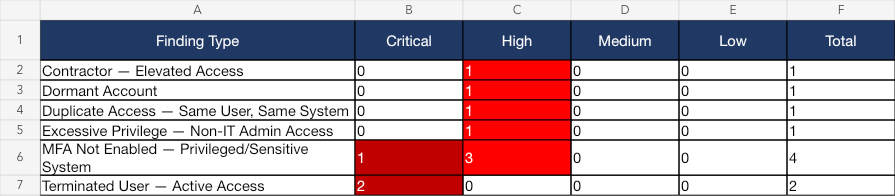
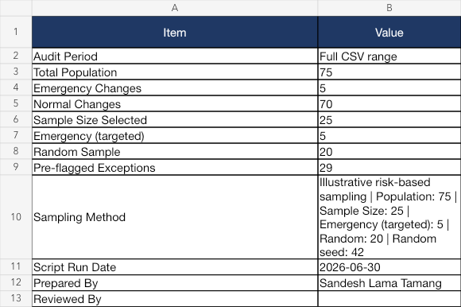
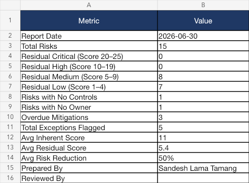
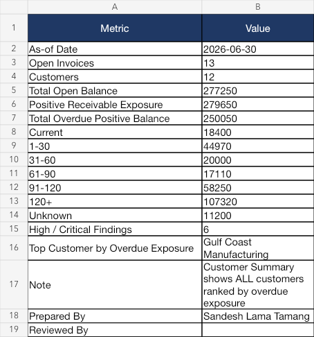

# Sample Outputs

These workbooks were generated from the scripts' built-in synthetic datasets. They let recruiters inspect finished workpapers without installing Python or running the tools.

## Access Review Analyzer

[Download the sample workbook](./access_review_report.xlsx)

## Change Log Sampler

[Download the sample workbook](./change_log_sample.xlsx)

The sample includes 75 changes, 25 selected items, five targeted emergency changes, and 29 pre-flagged exceptions. The default selection size is an illustrative portfolio rule, not a professional-standard requirement.

## Risk Score Calculator

[Download the sample workbook](./risk_assessment.xlsx)

## Aging Report Analyzer

[Download the sample workbook](./aging_report.xlsx)

All entities, users, transactions, risks, and findings are synthetic and intended only for portfolio demonstration.
